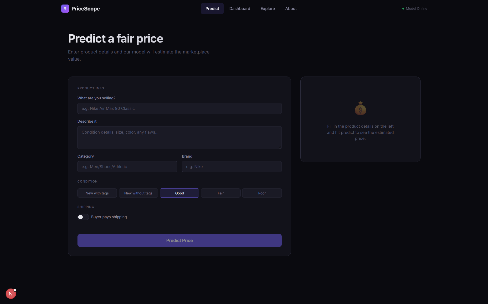
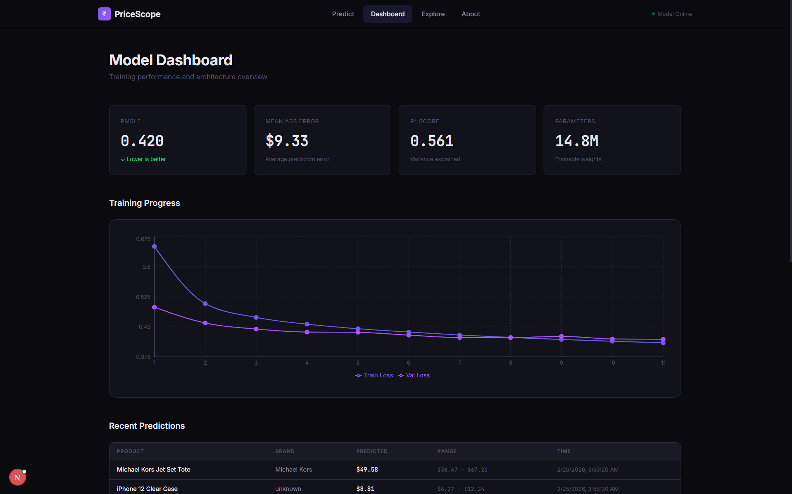
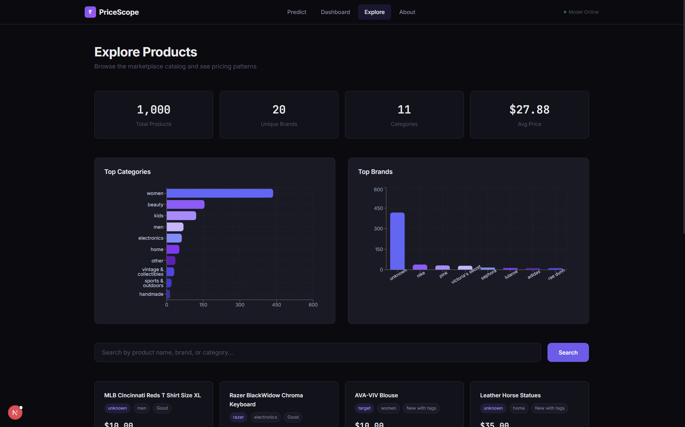

# PriceScope

[](https://github.com/Technocrat-dev/Marketplace-Price-Prediction/actions)
[](https://www.python.org/downloads/)
[](https://pytorch.org/)
[](https://fastapi.tiangolo.com/)
[](LICENSE)

A production-grade multimodal deep learning system that predicts marketplace product prices from text, categorical features, and item metadata. Built end-to-end: from raw data ingestion and model training to a served REST API and interactive frontend.

Trained on **1.48 million** Mercari product listings, achieving **0.430 RMSLE** on held-out test data with a model that fuses bidirectional LSTMs (with optional self-attention) for text understanding and learned categorical embeddings for structured features.

---

## Table of Contents

- [Screenshots](#screenshots)
- [Architecture](#architecture)
- [Results](#results)
- [Quick Start](#quick-start)
- [Docker Deployment](#docker-deployment)
- [API Reference](#api-reference)
- [Project Structure](#project-structure)
- [ML Engineering](#ml-engineering)
- [Configuration](#configuration)
- [Testing](#testing)
- [License](#license)

---

## Screenshots

**Prediction Form** -- Enter product details and get an instant price estimate with confidence range.



**Model Dashboard** -- Live training metrics, loss curves, and recent prediction history.



**Explore Products** -- Browse the catalog with category/brand analytics and full-text search.



---

## Architecture

The model jointly encodes product names, descriptions, and structured metadata through three parallel branches, then fuses them for price regression.

```
Input Layer
------------------------------------------------------------
  Product Name          Description           Structured Features
  (tokenized)           (tokenized)           brand, category (x3),
                                              condition, shipping
       |                     |                       |
       v                     v                       v
  +-----------+        +-----------+          +-------------+
  |  Embedding |        |  Embedding |          | 5 Embedding |
  |  (64-dim)  |        |  (64-dim)  |          |  Layers     |
  +-----------+        +-----------+          +------+------+
       |                     |                       |
       v                     v                       v
  +-----------+        +-----------+          +-------------+
  |  BiLSTM   |        |  BiLSTM   |          |    Dense    |
  |  (128-d)  |        |  (128-d)  |          |   + BN +    |
  |  2 layers |        |  2 layers |          |   Dropout   |
  +-----------+        +-----------+          +------+------+
       |                     |                       |
       v                     v                       |
  [Optional]           [Optional]                    |
  Attention            Attention                     |
       |                     |                       |
       +---------------------+-----------------------+
                             |
                      Concatenation (576-d)
                             |
                             v
                    +------------------+
                    |   Fusion MLP     |
                    |  576 > 256 > 128 |
                    |  + BatchNorm     |
                    |  + Dropout (0.3) |
                    +--------+---------+
                             |
                             v
                      log1p(price)
```

**Tech Stack**

| Layer       | Technology                                                |
|-------------|-----------------------------------------------------------|
| Training    | PyTorch, Adam, RMSLE loss, ReduceLR / Cosine scheduling   |
| Tuning      | Optuna with MedianPruner                                  |
| Baselines   | XGBoost, LightGBM, Ridge                                  |
| Explainability | SHAP (TreeExplainer)                                   |
| Export      | ONNX with validation                                      |
| API         | FastAPI, Uvicorn, SlowAPI rate limiting, Pydantic v2      |
| Database    | MongoDB with indexed product and prediction repositories  |
| Frontend    | Next.js 14, TypeScript, CSS Modules, Recharts             |
| DevOps      | Docker multi-stage builds, docker-compose, GitHub Actions |

---

## Results

### Deep Learning Model

| Metric           | Test Set    |
|------------------|-------------|
| RMSLE            | **0.430**   |
| MAE              | $8.42       |
| Median AE        | $4.71       |
| R-squared        | 0.482       |
| Parameters       | 15.2M       |

### Baseline Comparison

| Model            | RMSLE   | MAE      | R-squared | Train Time |
|------------------|---------|----------|-----------|------------|
| **BiLSTM + MLP** | **0.430** | **$8.42** | **0.482** | ~15 min  |
| XGBoost          | 0.555   | $12.18   | 0.301     | 8.7s       |
| LightGBM         | 0.559   | $12.34   | 0.295     | 3.2s       |
| Ridge Regression | 0.612   | $14.80   | 0.221     | 0.3s       |

The deep learning model outperforms all tabular baselines because it can extract semantic signals from free-text product names and descriptions that tree-based models cannot access.

### Dataset

| Split      | Samples    |
|------------|------------|
| Training   | 1,186,028  |
| Validation | 148,254    |
| Test       | 148,254    |

---

## Quick Start

### Prerequisites

- Python 3.10+
- Node.js 18+ (for frontend)
- MongoDB (optional, for data persistence)
- [Kaggle API credentials](https://www.kaggle.com/docs/api) (for dataset download)

### 1. Clone and install

```bash
git clone https://github.com/Technocrat-dev/Marketplace-Price-Prediction.git
cd Marketplace-Price-Prediction

python -m venv venv
source venv/bin/activate    # Linux/Mac
venv\Scripts\activate       # Windows

pip install -r requirements.txt
```

### 2. Download and preprocess data

```bash
python data/download.py

python -c "from src.data.preprocess import run_preprocessing_pipeline; run_preprocessing_pipeline('config/config.yaml')"
```

### 3. Train

```bash
# Full training
python scripts/train.py

# Quick test (2 epochs)
python scripts/train.py --quick

# Resume from checkpoint
python scripts/train.py --resume outputs/checkpoints/best_model.pt
```

### 4. Serve

```bash
# Start the API
uvicorn src.serving.app:app --host 0.0.0.0 --port 8000

# Start the frontend (separate terminal)
cd frontend && npm install && npm run dev
```

Open [http://localhost:3000](http://localhost:3000) for the web interface or [http://localhost:8000/docs](http://localhost:8000/docs) for the interactive API docs.

---

## Docker Deployment

Launch the entire stack with one command:

```bash
docker compose up --build
```

| Service      | URL                          | Description              |
|--------------|------------------------------|--------------------------|
| API          | http://localhost:8000        | FastAPI prediction server |
| Frontend     | http://localhost:3000        | Next.js web interface     |
| MongoDB      | mongodb://localhost:27017    | Data persistence          |
| API Docs     | http://localhost:8000/docs   | Swagger UI                |

---

## API Reference

Full interactive documentation available at `/docs` when the server is running.

### POST /predict -- Single prediction

```bash
curl -X POST http://localhost:8000/predict \
  -H "Content-Type: application/json" \
  -d '{
    "name": "Nike Air Max 90",
    "item_description": "Classic sneakers, barely worn, size 10",
    "category_name": "Men/Shoes/Athletic",
    "brand_name": "Nike",
    "item_condition_id": 2,
    "shipping": 1
  }'
```

```json
{
  "predicted_price": 68.42,
  "predicted_log_price": 4.23,
  "confidence_range": { "low": 54.74, "high": 85.53 },
  "input_summary": {
    "name": "nike air max 90",
    "brand": "nike",
    "category": "men/shoes/athletic",
    "condition": "2",
    "shipping": "seller pays"
  }
}
```

### POST /predict/batch -- Batch prediction (up to 100 items)

```bash
curl -X POST http://localhost:8000/predict/batch \
  -H "Content-Type: application/json" \
  -d '{"items": [{"name": "iPhone 12 Case"}, {"name": "Vintage Dress"}]}'
```

### POST /predict/csv -- CSV upload (up to 500 rows)

```bash
curl -X POST http://localhost:8000/predict/csv -F "file=@products.csv"
```

### POST /predict/explain -- Prediction with feature analysis

```bash
curl -X POST http://localhost:8000/predict/explain \
  -H "Content-Type: application/json" \
  -d '{"name": "Nike Air Max 90", "brand_name": "Nike"}'
```

### Other endpoints

| Endpoint                | Method | Description                          |
|-------------------------|--------|--------------------------------------|
| `/model/info`           | GET    | Architecture, metrics, loss curves   |
| `/products/search?q=`   | GET    | Search product catalog               |
| `/products/stats`       | GET    | Category and brand statistics        |
| `/predictions/recent`   | GET    | Prediction history                   |
| `/health`               | GET    | Service health and status            |

### API Features

| Feature             | Detail                                            |
|---------------------|---------------------------------------------------|
| Rate limiting       | 60 req/min (predict), 10 req/min (batch)          |
| Response caching    | LRU cache with TTL, keyed by MD5 of request       |
| API key auth        | Optional `X-API-Key` header (set in config)       |
| Request logging     | Method, path, latency, client IP per request      |
| Input validation    | Pydantic v2 schemas with field constraints         |

---

## Project Structure

```
Marketplace-Price-Prediction/
  config/
    config.yaml               Centralized hyperparameters and paths
  data/
    download.py               Kaggle dataset downloader
    raw/                      Raw TSV files (gitignored)
    processed/                NumPy arrays + vocabularies (gitignored)
  frontend/
    src/app/                  Pages: predict, dashboard, explore, about
    src/components/           Navbar, shared UI components
    src/lib/api.ts            Typed API client
    Dockerfile                Multi-stage Next.js build
  scripts/
    train.py                  Training entry point with checkpointing
    train_baselines.py        XGBoost, LightGBM, Ridge baselines
    tune.py                   Optuna hyperparameter search with pruning
    explain.py                SHAP feature importance analysis
    ingest_data.py            MongoDB data ingestion
    export_onnx.py            ONNX export with output validation
  src/
    data/                     Dataset, preprocessing, feature engineering
    db/                       MongoDB client and repositories
    models/                   BiLSTM + Attention + TabularEncoder + Fusion
    serving/                  FastAPI app, Pydantic schemas, middleware
    training/                 Trainer loop, evaluation, metrics
  tests/                      Unit and integration tests (pytest)
  .github/workflows/ci.yml   CI: lint, test, Docker build, frontend build
  Dockerfile                  Multi-stage API container (Python 3.11-slim)
  docker-compose.yml          Full-stack orchestration (API + Frontend + MongoDB)
```

---

## ML Engineering

### Hyperparameter Tuning

```bash
python scripts/tune.py --n-trials 30 --timeout 3600
```

Uses Optuna with `MedianPruner` to search over text encoder dimensions, fusion depth, dropout rates, learning rate, and attention. Unpromising trials are terminated early to save compute.

### Baseline Comparison

```bash
python scripts/train_baselines.py
```

Trains XGBoost, LightGBM, and Ridge regression on the same train/val/test splits for a fair comparison. Results are saved to `outputs/baseline_results.json`.

### SHAP Explainability

```bash
python scripts/explain.py --sample 100
```

Generates per-feature importance scores using SHAP TreeExplainer on an XGBoost proxy model. Output saved to `outputs/shap_explanations.json`.

### ONNX Export

```bash
python scripts/export_onnx.py
```

Exports the trained model to ONNX format with dynamic batch axes. Validates that ONNX outputs match PyTorch within 1e-4 tolerance.

---

## Configuration

All settings are centralized in [`config/config.yaml`](config/config.yaml):

| Section      | Key Parameters                                         |
|--------------|--------------------------------------------------------|
| `paths`      | Data directories, checkpoint and output paths          |
| `data`       | Max sequence lengths, vocabulary min frequency         |
| `model`      | Embedding dims, hidden dims, dropout, attention toggle |
| `training`   | Batch size, learning rate, epochs, scheduler, patience |
| `serving`    | Host, port, model version, API key, cache TTL          |
| `database`   | MongoDB URI, database name                             |

Environment variable overrides for Docker: `MONGODB_URI`, `MONGODB_DB`.

---

## Testing

```bash
# Run all unit tests (excluding MongoDB-dependent tests)
python -m pytest tests/ -v --ignore=tests/test_db.py

# Run with coverage
python -m pytest tests/ --cov=src --cov-report=term-missing

# Run a specific test file
python -m pytest tests/test_model.py -v

# Lint
ruff check src/ scripts/ tests/ --select E,F,W --ignore E501,E402
```

Test coverage includes:
- Text cleaning edge cases and category parsing
- Vocabulary building, encoding, serialization
- Model forward/backward pass and single-batch overfitting
- Loss function correctness and gradient flow
- API endpoint validation, error states, and input constraints
- MongoDB CRUD operations and aggregations (requires local MongoDB)

---

## License

MIT
